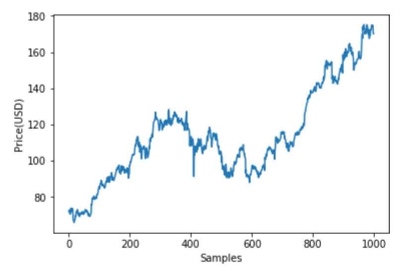
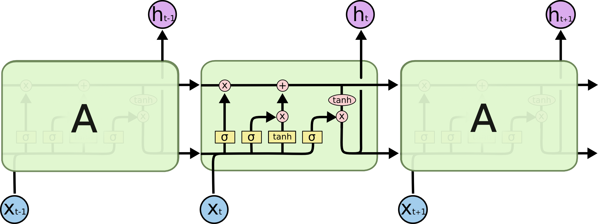
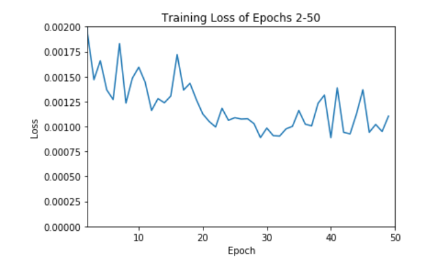
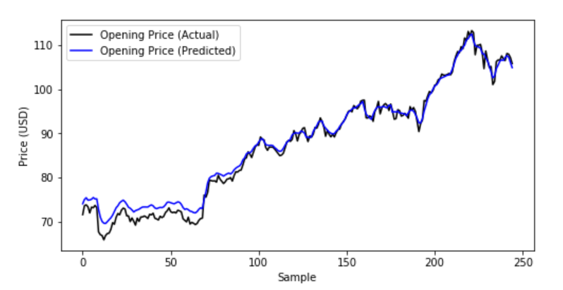
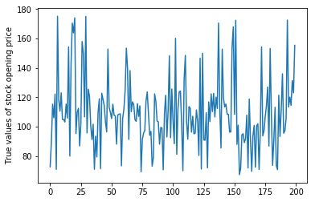
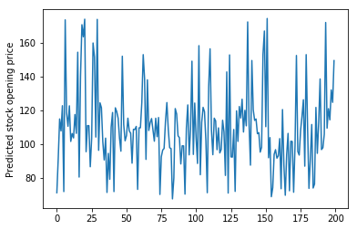
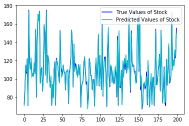
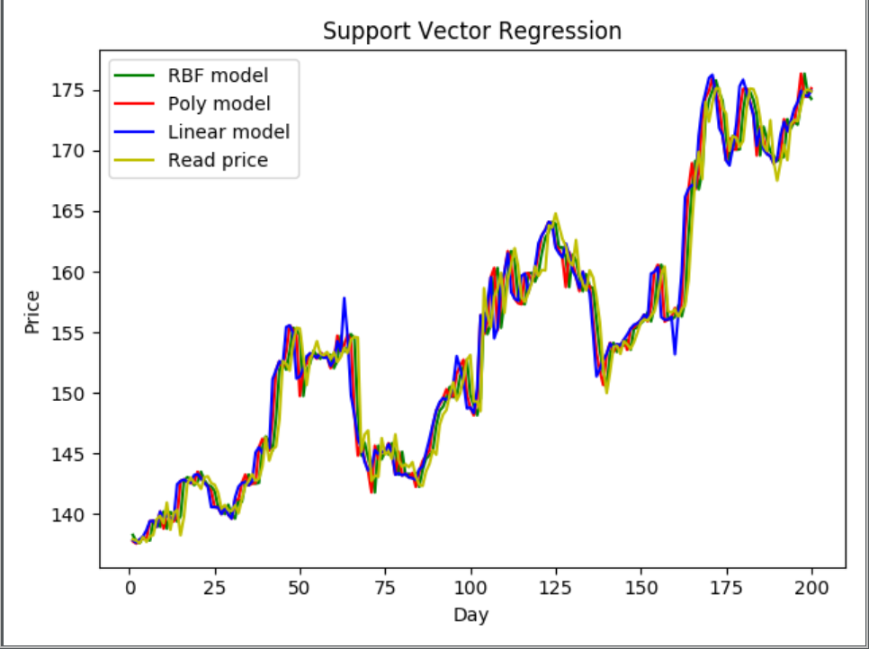

Predicting the Opening Stock Price

EECE5644

Introduction to Machine Learning 

Professor Deniz Erdogmus

James Dowd, Sowmika Mandava and Ziyi Yang

1. **ABSTRACT**

It is very hard to predict the behaviour of stock market prices as it is dependent on various factors like rational, irrational behaviour, physical factors etc,. Since all these factors are involved, the prediction becomes very difficult with great accuracy. So, we took up this as a challenge and decided to predict the opening stock price depending upon the previous five days closing stock prices using Machine Learning algorithms which can predict using great accuracies. We have used three approaches namely, Linear Regression, Multi-Layer LSTM (Long Short-term Memory) and Support Vector Regression to try solving this highly unpredictable problem.

1. **DATA GENERATION**

To generate our data, we utilized an API known as “Quandl”. It possesses a great amount of stock information including volume, highs, lows, opening prices, closing prices, etc. Using a Python code, we imported 1000 samples of closing and opening prices of Apple stock over the course of roughly 4 years. We reasoned that 1000 samples was sufficient to train a proper model and have enough data points in order to then perform validation and testing. 

What proved to be more tricky, however, was deciding our feature length of our data vectors. It was important that the data we were using was accurately describing the current market trends, but not being too short where we would not be able to predict anything useful from it. We ultimately decided that a feature vector of 5, by taking the closing prices over the previous 5 days, was a good middle-ground to base our models on. We then cycled through our data to create 1000 unique 6-element vectors of the following form that we would manipulate in our models:

{closing price of day 1, closing price of day 2, ... , closing price of day 5, opening price of day 6}

1. **MODELS AND RESULTS**
   1. **LSTM**

         

`    `*Figure 1: Opening AAPL Stock Price Samples                             Figure 2: LSTM Cell*

Recurrent neural networks, unlike feedback networks, are able to utilize previously examined data rather than solely the information currently being processed. It can be said that these networks possess “memory”, allowing them to go above and beyond traditional neural networks. Even though stock price is dependent on a wide variety of factors, when looking at a more complete image of a stock’s dataset, long term trends can be evident. For example, let’s take the 1000 vector dataset we decided to examine for this particular project. Figure 1 demonstrates about four years of Apple’s opening stock prices. There are clear similarities, in terms of the overall long-term rising and falling rates and even the shapes of the short, small peaks. Therefore, due to temporal patterns present throughout a lot of stock data, we believe an implementation of an RNN is a proper model to predict future stock prices using previous data points.

More specifically, we chose to implement an LSTM (or Long Short-Term Memory) due to its emphasis on learning order dependence. To do so, we implemented an LSTM network by using Keras, Python’s deep learning library. Stacked LSTM networks contain even more memory cells working together to train a set of data. Figure 2 demonstrates how each cell operates within an LSTM model. Three sigmoid functions work together to either “forget” information, “input” it for memory, or “output” it to the next cell. 

To implement this on Python, we followed the example of Reference 5. However, we expanded upon this by applying this to an application where one variable was to predict another, rather than future values of the same set. We also altered the LSTM to be optimal with our specific data set.  Firstly, as described earlier, data generation occurred first to import the Apple stock prices. For the LSTM model and code, we used slightly altered data sets than those described earlier due to the format of the algorithm. Rather than using the data in vector format, closing data was used each as one continuous column and the code automatically created 5-element features. Next, the code split our data sets into 800 training sets and 250 test tests. The 50 sample overlap was intended for validation and to better visualize our results. Due to the architecture of the LSTM cells in Figure 2, our code converted all of our data to scaled values between 0 and 1, and subsequently converted it back after training for visualization. We used our created LSTM model to then train our 800 samples over 50 epochs and tested our model on the 250 pre-defined testing samples.

`             `*Figure 3. Loss over Training Epochs            Figure 4. Actual vs. Predicted Stock Values*

As Shown in Figure 3, our LSTM model successfully trained across multiple epochs, demonstrating that there is a general trend with successive trials that our model is more precisely fitting the real data. Mean squared error was used to measure how well each model fit. In Figure 4, we can see that with the exception of slight y-axis error, our model fits the original data pretty accurately, and therefore we have successfully implemented an LSTM neural network to perform our desired function.

1. **LINEAR REGRESSION**

Linear Regression is used to model the relationship between a dependent variable and one or more independent variables. The regression that we implemented in our project is known as trend forecasting which is used to predict the trends and future values. In our project, we tried to fit a linear regression model to the previous five days closing price values and based on that we tried to predict the opening price of day six. While implementing this algorithm, we took 80% as training data and 20% as test data randomly as linear regression is not dependent on time frames.

*Figure 5: True Opening Stock Price Values                     Figure 6: Predicted Opening Stock Price Values*

*Figure 7. True vs. Predicted Stock Values using Linear Regression*

Figure 7 represents the overlap of true and predicted values of opening stock price values using linear regression. Both the true and predicted values overlap each other almost perfectly which implies that the accuracy of our prediction is very high and we have successfully implemented linear regression for our desired function.

1. **SUPPORT VECTOR REGRESSION**

SVR is a bit different from SVM. As the name suggests the SVR is a regression algorithm , so we can use SVR for working with continuous Values instead of Classification which is SVM. 

1. Kernel: The function used to map a lower dimensional data into a higher dimensional data.
1. Hyper Plane: In SVM this is basically the separation line between the data classes. Although in SVR we are going to define it as the line that will help us predict the continuous value or target value.
1. Boundary line: In SVM there are two lines other than Hyper Plane which creates a margin . The support vectors can be on the Boundary lines or outside it. This boundary line separates the two classes. In SVR the concept is the same.
1. Support vectors: This are the data points which are closest to the boundary. The distance of the points is minimum or least.

In simple regression we try to minimise the error rate. While in SVR we try to fit the error within a certain threshold. SVR is based on SVM but slightly different from SVM. In one sentence, the SVM is trying to maximize  the distance of the closest sample point to the hyperplane but SVR is trying to minimize  the distance of the furthest sample point to the hyperplane. When doing simple regression we only say it’s valid when f(x) =y exactly and we calculate its loss. But in SVR we are allowed  to set a tolerance which means errors are allowed in a certain range. We just calculate the loss with the data lies outside the tolerance. When we take RBF kernel, we have to consider the gamma, as gamma increased, the performance to model the training set increase but the performance to model the test data decreases. And the complexity rises which may lead to over fitting. C is a penalty factor, when C goes to infinity it means no errors are allowed and if it is 0, no errors are considered. SVR puts data into higher dimensions, and to find a hyperplane that can divide the data linearly and then project the hyperplane back to the low dimension. Kernel functions will replace the linear factors in a linear function and make it non-linearized. So we no longer need to drive data into higher dimensions and it saves time and prevent overfitting. In other words, Kernel functions project data into higher dimensions(hidden transformation).

*Figure 8. True Value vs. Predicted Value with SVR*

1. **CONCLUSION**

From the results that we obtained using the three machine learning algorithms, we observed that almost all of them are very much useful in predicting the stock prices with best accuracy. We considered a data set where the stock prices in the market are not affected by major factors like depression, which is why all the three algorithms have given results with good accuracy. Incase of events like depression or sudden changes in the market, LSTM works with better accuracy compared to the other two algorithms.

References:

1) <https://machinelearningmastery.com/gentle-introduction-long-short-term-memory-networks-experts/>
1) <https://skymind.ai/wiki/lstm>
1) <https://towardsdatascience.com/machine-learning-techniques-applied-to-stock-price-prediction-6c1994da8001>
1) <https://www.statisticssolutions.com/what-is-linear-regression/>
1) <https://gilberttanner.com/2018/09/28/keras-stock-price-prediction-using-a-recurrent-neural-network/>
